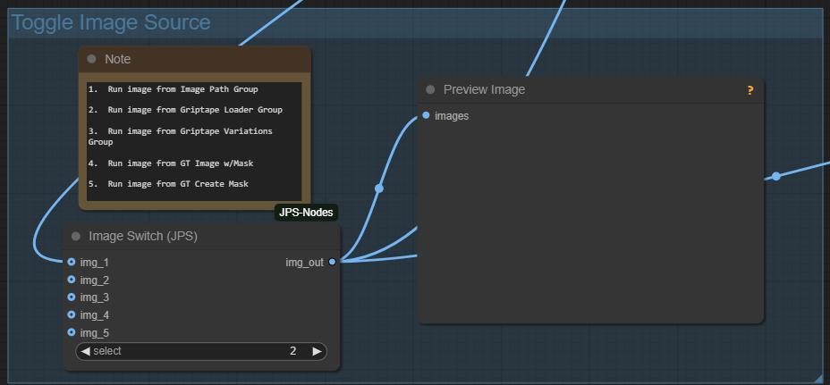
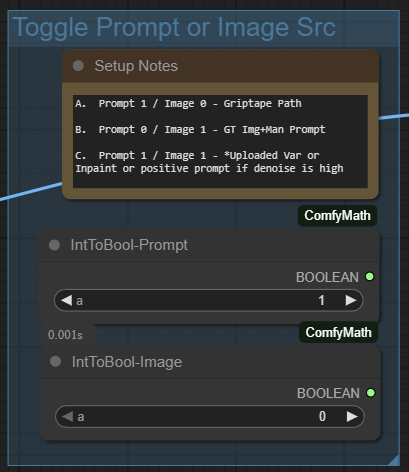
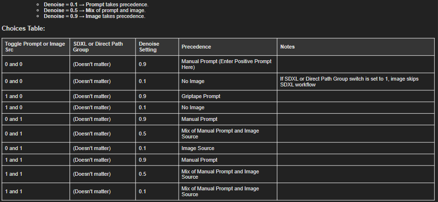
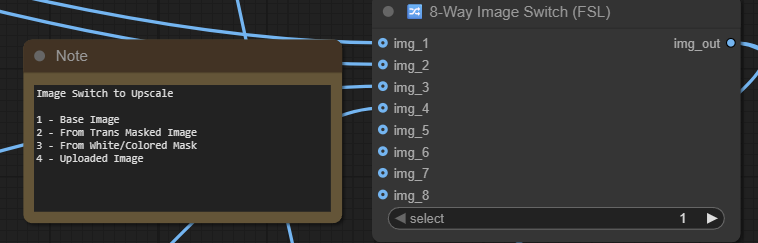

# Tshirt Designer Workflow v2git clone https://github.com/comfyanonymous/ComfyUI.git
git clone https://github.com/comfyanonymous/ComfyUI.git
.0 for ComfyUI

## Overview
This project provides a specialized **ComfyUI** workflow designed to create **masked images** for T-shirts, apparel, and other printable products.  
It features custom nodes, flexible image/prompt control, Griptape API integration, and metadata optimization.

Originally developed for internal use, the workflow has grown into a versatile system for high-quality, transparent-background image creation.

---

## Features
- **Custom Sampler and Scheduler nodes** to properly embed settings into image metadata.
- **5-way image toggle** system: Choose between uploaded images, Griptape-generated images, or manual prompts.
- **Denoise-controlled priority**: Flexibly blend or prioritize prompt vs. image input.
- **Direct or SDXL processing path**: Choose between full SDXL workflow or direct transparent background processing.
- **Supports Griptape API** (OpenAI + Black Forest Labs) for automated image generation.
- **Designed for upscaling** (e.g., with Topaz Photo AI).
- **Ready-to-print transparent PNG output**.
- **Automatic masking based on mask selection**
- **Upscaling module is included**

---

## Requirements
- **ComfyUI** installed and operational.
- **FSL Custom nodes included** in this workflow:
  - **`Sampler Config Hub`** - supports sampler data to metadata node
  - **`Manual Alpha Mask Painter`** - when creating a mask directly in the "load image" node the Mask Painter node converts the mask to Alpha hannel (required by Griptape).
  - **`8 Way Image Switch`**

- **API keys** for:
  - **OpenAI**
  - **Black Forest Labs**
  
  > Note: Keys are now entered directly inside the **Griptape settings window** in ComfyUI.  
  > (Instructions for obtaining these keys are available online or in Griptape documentation.)

---

## Griptape Groups Explained

- **Griptape Loader** 
  - Text to image prompt using Griptape nodes.  It is set for the Open AI driver but there are several other options available.
- **Griptape Variations**
  - This standard Griptape group allows for minor variations in an image.  I am not yet sure about it's value but have included it.
- **GT Image w/Mask - Inpainting**
  - Use this group when doing inpainting with an image where the mask has been prepared.  Make sure to use an alpha-channel mask for Griptape.
- **GT Create Mask - Inpainting**
  - Use this group to upload an image and then create a mask.  Right click on the uploaded image and select 'open in maskeditor'.  This will create a black mask on the image.  The custom node - 'Manual Alpha Mask Painter' will convert the mask to an alpha channel.
- **NOTE OF CAUTION**
  - Be sure disable any API groups you aren't using to avoid using API tokens unnecessarily.

---

## Installation
1. Clone or download this repository.git clone https://github.com/comfyanonymous/ComfyUI.git
2. Copy the `custom_nodes` into your ComfyUI `custom_nodes` directory.
3. Copy the workflow `.json` file into your `users/default/workflows` directory.
4. Configure your Griptape API keys inside ComfyUI Settings -> Griptape -> API Keys.
5. Launch ComfyUI and load the workflow!

---

## Usage
- Choose your image source with the **5-Way Toggle Image Switch**.
- Set the **Prompt vs Image Source toggle** depending on your needs.
- Adjust the **Denoise setting** in the KSampler:
  - `0.9` → Image takes precedence
  - `0.5` → Mixed image and prompt
  - `0.1` → Prompt takes precedence
- Set the **SDXL/Direct Path** switch if you want to bypass SDXL for faster processing.

> Detailed instructions are available in the file:  
> **[`Tshirt_Workflow_Notes.md`](./Tshirt_Workflow_Notes.md)**

---

## Workflow Switches Explained

This switch determined what path is used for image creation.  For example item 1 bypassed Griptape groups and uses the image loaded in the Image Path Group.  This makes it a pure SDXL workflow.

This switch determines whether an image or a prompt will be used (or both together).  It is used in conjunction with the denoise setting as defined in this table below - 

This switch determines if a Griptape image should be processed through the SDXL workflow for further refinement or being reinserted downstream to start the masking process.  

This switch determines which image gets processed through the upscaler.

---

## License
[MIT License](LICENSE)  
You are free to use, modify, and distribute this workflow with attribution.

---

## Credits
- Workflow and custom node design by **Fred LeFevre**.
- Powered by **ComfyUI** and **Griptape AI**.

---
